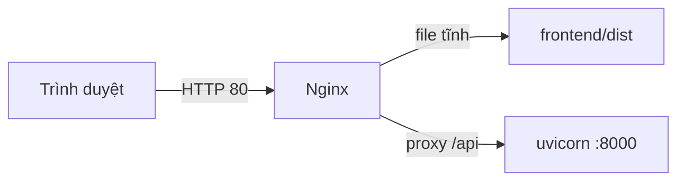

# Triển khai lên VPS — hướng dẫn chi tiết (Ubuntu/Debian)

**Mục tiêu:** Trình duyệt mở `http://IP-VPS/` thấy giao diện web; mọi gọi API đi qua cùng địa chỉ dưới đường dẫn `/api`. Backend chỉ lắng nghe nội bộ `127.0.0.1:8000`, không để hở cổng 8000 ra internet.



---

## Trước khi bắt đầu — bạn cần có

| Thứ cần | Ghi chú |
|--------|---------|
| VPS Ubuntu 22.04/24.04 hoặc Debian tương đương | Đã SSH được vào bằng user `root` hoặc user có `sudo` |
| IP VPS (hoặc tên miền) | Thay mọi chỗ `YOUR_IP` trong lệnh bên dưới |
| Trên máy Windows | Đã cài Node.js, đã `npm install` trong thư mục `frontend` (hoặc dùng `npm ci` nếu có `package-lock.json`) |
| Mở cổng 80 | Firewall nhà cung cấp + `ufw` (bước bảo mật) |

---

## Phần A — Bảo mật cơ bản (nên làm ngay)

### A1. Đổi mật khẩu root (nếu mật khẩu từng lộ)

```bash
passwd
```

### A2. Cập nhật hệ thống

```bash
sudo apt update && sudo apt upgrade -y
```

### A3. Firewall `ufw`

```bash
sudo ufw allow OpenSSH    # hoặc: sudo ufw allow 22/tcp
sudo ufw allow 80/tcp
sudo ufw allow 443/tcp
sudo ufw enable
sudo ufw status
```

**Lưu ý:** Chỉ bật `ufw enable` sau khi đã cho phép SSH, kẻo khóa mất kết nối.

### A4. (Tuỳ chọn) User sudo + SSH key

Tạo user, thêm vào nhóm sudo, copy public key vào `~/.ssh/authorized_keys`, sau đó trong `/etc/ssh/sshd_config` có thể đặt `PermitRootLogin no`. Phần này tùy chính sách của bạn; deploy có thể làm với `root` trước, siết sau.

---

## Phần B — Chuẩn bị trên máy tính của bạn (Windows)

### B1. Mở terminal tại thư mục gốc dự án

Thư mục chứa cả `frontend` và `backend_python`.

### B2. Cài dependency và build frontend

```powershell
cd frontend
npm ci
# Nếu không dùng lock file chặt: npm install
npm run build
cd ..
```

**Kết quả:** Thư mục `frontend/dist` có `index.html` và thư mục `assets/`. Đây là bản chạy production.

### B3. Kiểm tra nhanh cục bộ (tuỳ chọn)

```powershell
cd frontend
npm run preview
```

Mở URL hiện trên terminal; nếu chỉ test API qua `/api` thì preview không proxy backend — bước này chỉ để chắc build không lỗi.

---

## Phần C — Trên VPS: cài phần mềm

Đăng nhập SSH:

```bash
ssh root@YOUR_IP
# cổng khác 22: ssh -p PORT root@YOUR_IP
```

Cài Nginx và Python:

```bash
sudo apt update
sudo apt install -y nginx python3 python3-venv python3-pip
```

Kiểm tra Nginx:

```bash
sudo systemctl status nginx
```

---

## Phần D — Tạo thư mục và đưa file lên server

### D1. Trên VPS: tạo cấu trúc thư mục

```bash
sudo mkdir -p /var/www/visitor-api
sudo mkdir -p /var/www/visitor-frontend
```

### D2. Từ máy Windows (PowerShell), ở thư mục gốc dự án

Thay `YOUR_IP` bằng IP VPS.

**Backend** — copy cả thư mục `backend_python` vào `/var/www/visitor-api/`:

```powershell
scp -r ".\backend_python" "root@YOUR_IP:/var/www/visitor-api/"
```

Sau lệnh này trên server sẽ có: `/var/www/visitor-api/backend_python/main.py`, `requirements.txt`, các file `.json` dữ liệu, v.v.

**Frontend** — copy thư mục `dist` vào `/var/www/visitor-frontend/` (giữ tên `dist` cho khớp cấu hình Nginx mẫu):

```powershell
scp -r ".\frontend\dist" "root@YOUR_IP:/var/www/visitor-frontend/"
```

Đường dẫn trên server: `/var/www/visitor-frontend/dist/index.html`.

**Nếu `scp` hỏi xác nhận host key:** gõ `yes`. Nếu dùng key SSH thay vì mật khẩu, đảm bảo agent đã load key.

### D3. (Cách khác) Dùng Git trên VPS

```bash
cd /var/www
sudo git clone YOUR_REPO_URL visitor-repo
# rồi copy/link backend_python và build frontend trên server (cần cài Node.js LTS)
```

Cách này phù hợp khi bạn quen Git; bản hướng dẫn chính vẫn là `scp` như trên.

---

## Phần E — Python virtualenv và quyền file

### E1. Tạo venv và cài package

Trên VPS:

```bash
sudo python3 -m venv /var/www/visitor-api/venv
sudo /var/www/visitor-api/venv/bin/pip install --upgrade pip
sudo /var/www/visitor-api/venv/bin/pip install -r /var/www/visitor-api/backend_python/requirements.txt
```

### E2. Gán quyền cho user `www-data` (service sẽ chạy với user này)

Backend cần **đọc code** và **ghi** file `visitors_data.json`, `visits_data.json`:

```bash
sudo chown -R www-data:www-data /var/www/visitor-api/backend_python
sudo chown -R www-data:www-data /var/www/visitor-api/venv
```

Thư mục `visitor-frontend` chỉ cần đọc:

```bash
sudo chown -R root:root /var/www/visitor-frontend
sudo chmod -R a+rX /var/www/visitor-frontend
```

---

## Phần F — Systemd: tự chạy API khi reboot

### F1. Tạo file service

```bash
sudo nano /etc/systemd/system/visitor-api.service
```

Dán nội dung sau (giống `deploy/visitor-api.service.example`):

```ini
[Unit]
Description=Visitor Access Control API (FastAPI / uvicorn)
After=network.target

[Service]
Type=simple
User=www-data
Group=www-data
WorkingDirectory=/var/www/visitor-api/backend_python
Environment=PATH=/var/www/visitor-api/venv/bin
ExecStart=/var/www/visitor-api/venv/bin/uvicorn main:app --host 127.0.0.1 --port 8000
Restart=on-failure
RestartSec=5

[Install]
WantedBy=multi-user.target
```

Lưu file (`Ctrl+O`, Enter, `Ctrl+X`).

**Biến môi trường (SMTP, CORS):** có thể thêm dòng, ví dụ:

```ini
EnvironmentFile=/var/www/visitor-api/backend_python/.env
```

Khi đó tạo file `.env` trên server (không commit lên Git), nội dung tham khảo `backend_python/.env.example`.

### F2. Kích hoạt service

```bash
sudo systemctl daemon-reload
sudo systemctl enable visitor-api
sudo systemctl start visitor-api
sudo systemctl status visitor-api
```

**Nếu `status` báo failed:**

```bash
sudo journalctl -u visitor-api -n 50 --no-pager
```

Sửa lỗi (thiếu module, sai đường dẫn, quyền file), rồi:

```bash
sudo systemctl restart visitor-api
```

### F3. Thử API từ chính VPS

```bash
curl -s http://127.0.0.1:8000/ | head
```

Kỳ vọng: JSON dạng `{"message": "Python mock API ..."}`.

### F4. Lưu ý quan trọng về `127.0.0.1` và IP public

- `127.0.0.1` (localhost) luôn trỏ tới **chính máy đang chạy lệnh/trình duyệt**.
- Nếu bạn mở trình duyệt trên Windows và gõ `http://127.0.0.1:8000`, đó là máy Windows, **không phải VPS**.
- Để test từ máy ngoài, dùng IP public của VPS: `http://YOUR_IP:8000/` (chỉ khi bạn chủ động mở cổng 8000).
- Cấu hình khuyến nghị production: giữ API ở `127.0.0.1:8000` và cho Nginx proxy qua `/api`.
- Chỉ đổi sang `--host 0.0.0.0` khi bạn thực sự muốn public trực tiếp cổng 8000.

---

## Phần G — Cấu hình Nginx

### G1. Tạo site

```bash
sudo nano /etc/nginx/sites-available/visitor
```

Dán nội dung (theo `deploy/nginx-visitor.conf.example`). Kiểm tra hai chỗ:

- `server_name`: có thể để `_` (mặc định), hoặc ghi IP/tên miền của bạn.
- `root`: phải trỏ đúng tới thư mục chứa `index.html` của bản build:

```nginx
server {
    listen 80;
    listen [::]:80;
    server_name _;

    root /var/www/visitor-frontend/dist;
    index index.html;

    location /media/ {
        alias /var/www/visitor-api/media/;
        access_log off;
    }

    location /api {
        proxy_pass http://127.0.0.1:8000;
        proxy_http_version 1.1;
        proxy_set_header Host $host;
        proxy_set_header X-Real-IP $remote_addr;
        proxy_set_header X-Forwarded-For $proxy_add_x_forwarded_for;
        proxy_set_header X-Forwarded-Proto $scheme;
        proxy_connect_timeout 60s;
        proxy_send_timeout 60s;
        proxy_read_timeout 60s;
    }

    location / {
        try_files $uri $uri/ /index.html;
    }
}
```

### G2. Bật site và tắt site mặc định (tránh trùng `default`)

```bash
sudo ln -sf /etc/nginx/sites-available/visitor /etc/nginx/sites-enabled/visitor
sudo rm -f /etc/nginx/sites-enabled/default
```

### G3. Kiểm tra cú pháp và nạp lại Nginx

```bash
sudo nginx -t
sudo systemctl reload nginx
```

Nếu `nginx -t` báo lỗi, sửa file cấu hình rồi chạy lại.

---

## Phần H — Kiểm tra end-to-end

1. Trên trình duyệt (máy bất kỳ): mở `http://YOUR_IP/`  
   → Phải thấy ứng dụng React.

2. API qua Nginx:

   ```bash
   # Chỉ cần kiểm tra Nginx proxy đúng: endpoint này có thể trả 401/403 vì thiếu token,
   # nhưng sẽ không phải 404 html của Nginx.
   curl -i -s "http://YOUR_IP/api/visitors?pageNumber=1&pageSize=1" | head
   ```

   → Kỳ vọng: `HTTP/1.1 401` (thiếu header `Authorization`) hoặc `403` (role không đủ).
   Nếu bạn thấy trang HTML `404 Not Found` của Nginx thì là proxy `/api` chưa đúng.

2.1. Test login mẫu (để chắc backend thật sự hoạt động)

Backend có tài khoản demo:
- `admin` / `admin123`
- `baove` / `baove123`
- `letan` / `letan123`

Chạy:

```bash
curl -i -s -X POST "http://YOUR_IP/api/auth/login" \
  -H "Content-Type: application/json" \
  -d "{\"username\":\"admin\",\"password\":\"admin123\"}" | head -n 20
```

Kỳ vọng: `200 OK` và trong body có `accessToken`.

3. Đăng nhập thử trên giao diện (nếu có). Nếu lỗi mạng, mở **DevTools → Network** xem request có đi tới `/api/...` không.

4. Nếu test trực tiếp cổng 8000 từ máy Windows:

   ```powershell
   curl http://YOUR_IP:8000/
   ```

   Không dùng `127.0.0.1` trên máy Windows để test VPS.

**Frontend production** dùng base URL `/api` — không cần mở cổng 8000 trên firewall công cộng.

---

## Phần I — HTTPS với Let’s Encrypt (khi đã có tên miền)

1. Trỏ **A record** tên miền về IP VPS.
2. Sửa `server_name` trong file Nginx thành `tenmien.com www.tenmien.com`.
3. Cài Certbot:

   ```bash
   sudo apt install -y certbot python3-certbot-nginx
   sudo certbot --nginx -d tenmien.com -d www.tenmien.com
   ```

Certbot sẽ chỉnh SSL và tự gia hạn.

---

## Phần J — Dữ liệu và backup

- File dữ liệu: `visitors_data.json`, `visits_data.json` trong `/var/www/visitor-api/backend_python/`.
- Backup định kỳ (ví dụ copy ra máy khác hoặc object storage):

  ```bash
  sudo tar -czvf ~/visitor-data-backup.tar.gz -C /var/www/visitor-api/backend_python visitors_data.json visits_data.json
  ```

---

## Xử lý sự cố nhanh

| Hiện tượng | Hướng xử lý |
|------------|-------------|
| `502 Bad Gateway` trên `/api` | `sudo systemctl status visitor-api`, xem log `journalctl -u visitor-api`. Thường do API chưa chạy hoặc sai cổng. |
| `ERR_CONNECTION_REFUSED` khi mở `127.0.0.1:8000` trên Windows | Bạn đang truy cập localhost của máy Windows. Hãy dùng `http://YOUR_IP/` (qua Nginx) hoặc `http://YOUR_IP:8000/` nếu đã mở public cổng 8000. |
| Trang trắng, 404 tĩnh | Kiểm tra `root` trong Nginx có đúng `/var/www/visitor-frontend/dist` và trong đó có `index.html`. |
| Permission denied khi ghi JSON | `chown -R www-data:www-data /var/www/visitor-api/backend_python` |
| Cổng 80 không vào được | `sudo ufw status`, firewall nhà cung cấp VPS, Nginx `systemctl status nginx` |
| CORS trên môi trường lạ | Chỉ khi frontend và API **khác** origin; cùng host + `/api` thì không cần CORS đặc biệt. Xem `backend_python/.env.example` (`CORS_ORIGINS`). |

---

## Biến môi trường (nhắc lại)

- **Backend:** `backend_python/.env.example` — SMTP, `CORS_ORIGINS`.
- **Frontend:** `frontend/.env.production.example` — chỉ khi API không cùng host (CDN, subdomain API riêng); khi đó set `VITE_API_BASE_URL` rồi build lại.

---

Sau khi mọi thứ chạy ổn, nên rà soát lại **A4** (tắt SSH root, chỉ key) và giữ **backup** JSON định kỳ.
